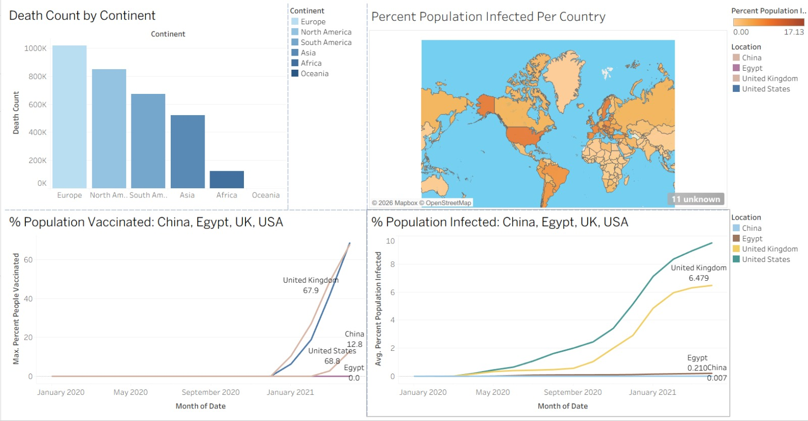
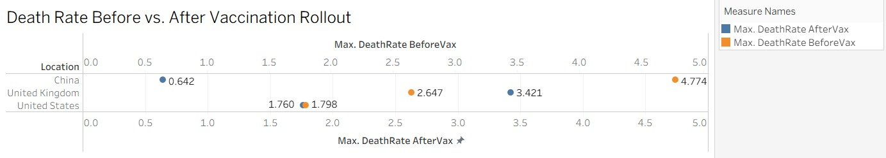

# SQL Data Analysis Portfolio
Two SQL projects: exploratory analysis of global COVID-19 data (visualized in Tableau), and a data cleaning project on a raw Nashville housing dataset.
## Contents
- [COVID-19 Data Exploration & Dashboard](#covid-19-data-exploration--dashboard)
- [Nashville Housing Data Cleaning](#nashville-housing-data-cleaning)

## COVID-19 Data Exploration & Dashboard
Exploratory SQL analysis of global COVID-19 case, death, and vaccination data, visualized in Tableau.

## Data

- `CovidDeaths.csv` — daily cases, deaths, and population by location
- `CovidVaccinations.csv` — daily vaccination records by location

## Tools

- **SQL Server (T-SQL)** for data cleaning, aggregation, and analysis
- **Tableau** for dashboarding and visualization

## SQL Analysis

All queries are in [`Queries.sql`](./Queries.sql). Highlights include:

- Total cases vs. total deaths (death percentage) by country
- Total cases vs. population (infection percentage) by country
- Countries ranked by highest infection rate relative to population
- Countries ranked by highest death count
- Global daily totals (cases, deaths, death percentage)
- Rolling vaccinated population over time using a window function (`SUM() OVER (PARTITION BY ... ORDER BY ...)`), implemented both as a CTE and as a temp table
- Death rate before vs. after each country's vaccination campaign began, using each country's first valid vaccination date as the cutoff

## Dashboard 1 — Global Overview



Four views summarizing the global picture:

- **Death Count by Continent** — bar chart of total deaths per continent. Europe leads (~1M), followed by North America, South America, Asia, and Africa, with Oceania near zero.
- **Percent Population Infected Per Country** — world map colored by cumulative infection rate (0–17.13%). The US and much of Europe stand out as the most heavily infected relative to population.
- **% Population Vaccinated over time** (China, Egypt, UK, USA) — line chart of the rolling vaccinated share of each population. Vaccination only takes off around January 2021, with the UK and US reaching ~68% and China ~12.8% by the end of the period.
- **% Population Infected over time** (same four countries) — the US climbs to ~9.8% and the UK to ~6.5%, while Egypt (0.21%) and China (0.007%) stay near zero (see notes below).

## Dashboard 2 — Death Rate Before vs. After Vaccination Rollout



Compares each country's death rate (deaths per confirmed case) in the period before its first recorded vaccination vs. after, for China, the UK, and the US. The results differ by country: China's death rate dropped sharply (4.77% → 0.64%), the US stayed essentially flat (1.80% → 1.76%), and the UK's rose (2.65% → 3.42%) This is a cutoff-based comparison capturing many overlapping factors (variants, testing coverage, reporting lags), not a measure of vaccine effectiveness in isolation. The exact values can be reproduced with the verification query in [`Queries.sql`](./Queries.sql):

| Location | DeathRate BeforeVax | DeathRate AfterVax |
|---|---|---|
| China | 4.77% | 0.64% |
| United Kingdom | 2.65% | 3.42% |
| United States | 1.80% | 1.76% |

Egypt is excluded from this dashboard only: its `new_vaccinations` field is empty in the source data, so no first-vaccination date could be established to split the before/after periods.

## Notes on the Data

- **Egypt** — vaccination figures are understated due to reporting gaps: only 4 sparse `total_vaccinations` snapshots exist for the entire window (Jan–Apr 2021).
- **China** — near-zero percentages come down to an enormous population denominator (~1.4B) combined with strict early lockdowns suppressing case growth.

## Nashville Housing Data Cleaning

SQL-only data cleaning project on a raw Nashville housing sales dataset — standardizing formats, filling missing values, splitting compound fields, removing duplicates, and dropping unused columns.

### Data

`NashvilleHousing` — property sale records including ParcelID, PropertyAddress, SaleDate, SalePrice, OwnerName, OwnerAddress, SoldAsVacant, and related fields.

### Tools

SQL Server (T-SQL)

### Cleaning Steps

All queries are in `NashvilleQueries.sql`. Steps performed, in order:

**1. Populate missing PropertyAddress**
Some rows had a NULL PropertyAddress. Since ParcelID uniquely identifies a property, a self-join on ParcelID (excluding a row matching itself via UniqueID) was used to pull the address from another row for the same parcel:
```sql
UPDATE a
SET PropertyAddress = ISNULL(a.PropertyAddress, b.PropertyAddress)
FROM NashvilleHousing a
JOIN NashvilleHousing b
    ON a.ParcelID = b.ParcelID
    AND a.UniqueID <> b.UniqueID
```

**2. Split PropertyAddress into Address / City**
PropertyAddress was stored as a single comma-separated string. Split into `PropertySplitAddress` and `PropertySplitCity` using `SUBSTRING` + `CHARINDEX`.

**3. Split OwnerAddress into Address / City / State**
OwnerAddress had three comma-separated parts. Split into `OwnerSplitAddress`, `OwnerSplitCity`, `OwnerSplitState` using `PARSENAME` (after swapping commas for periods, since PARSENAME only splits on periods).

**4. Standardize SoldAsVacant**
Added `SoldAsVacantText`, converting the existing 0/1 `bit` values into readable 'Yes'/'No' labels via a `CASE` statement.

**5. Remove duplicate rows**
Used `ROW_NUMBER() OVER (PARTITION BY ParcelID, PropertyAddress, SalePrice, SaleDate, LegalReference ORDER BY UniqueID)` inside a CTE to identify exact duplicate sale records (same parcel, address, price, date, and legal reference). Rows with `row_num > 1` were confirmed, then deleted.

**6. Drop unused columns**
Removed the original `OwnerAddress`, `TaxDistrict`, and `PropertyAddress` columns after their cleaned/split replacements were created and verified.

### Notes

- `SoldAsVacant` was already stored as `bit` (0/1) rather than mixed text (Y/N/Yes/No), so the standard "standardize Y/N" step from most tutorials on this dataset didn't apply here — the type already enforced a consistent format.
- Original columns were kept until their replacements were verified, then dropped in a single pass at the end rather than immediately after each split.
